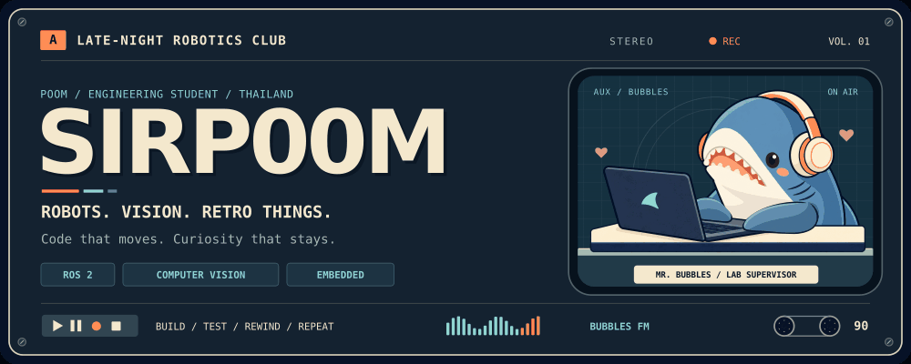
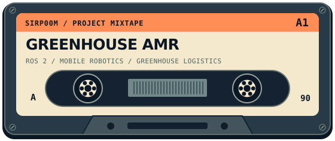
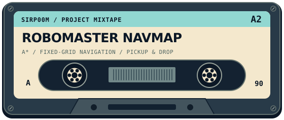
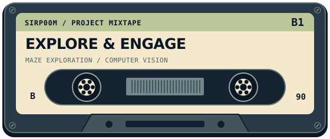
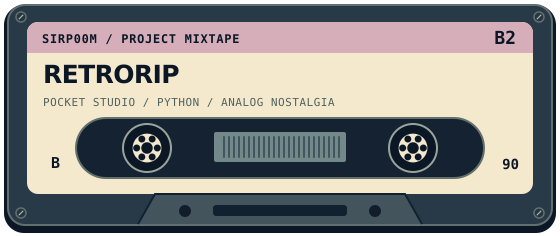
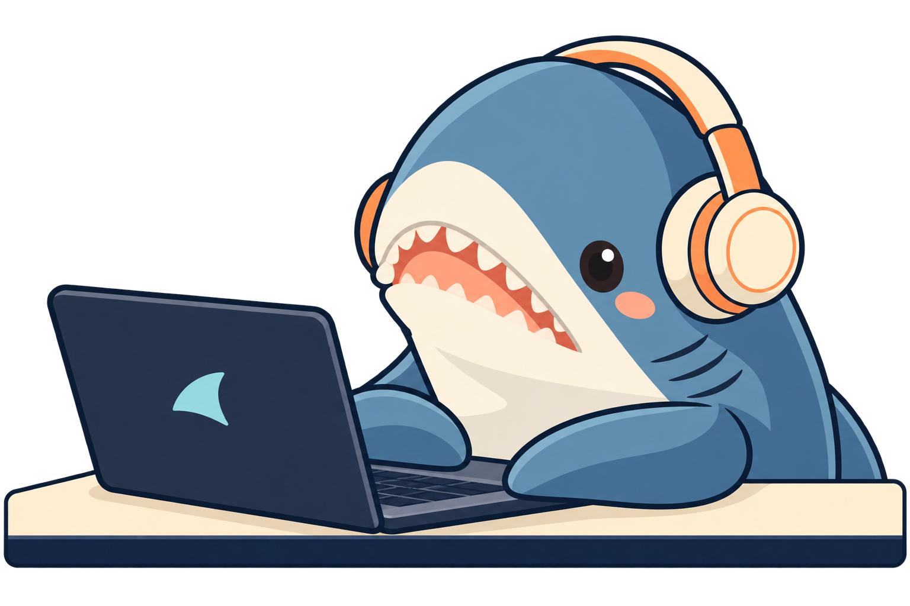

<!-- Upload this file AND the assets directory to the root of SIRP00M/SIRP00M. -->
<p align="center">
  <picture>
    <source media="(prefers-reduced-motion: reduce)" srcset="./assets/bubbles-lab.png">
    
  </picture>
</p>

<h1 align="center">Hey, I'm Poom 🦈</h1>

<p align="center">
  <b>Computer engineering student from Thailand.</b><br>
  Building robots, teaching cameras to see, and making software with a little personality.
</p>

<p align="center">
  <a href="https://github.com/SIRP00M?tab=repositories">Explore my projects</a>
  &nbsp;·&nbsp;
  <a href="https://github.com/SIRP00M/Greenhouse-Logistics-AMR-ROS2">Visit the robot lab</a>
  &nbsp;·&nbsp;
  <a href="https://github.com/SIRP00M/RetroRip">Press play on RetroRip</a>
</p>

---

### 01 / SIDE A — THE HUMAN

I like code that makes something **move, see, or react**. My work lives somewhere between autonomous robots, computer vision, embedded hardware, and the occasional retro desktop app.

Most days, I'm connecting sensors to decisions, testing those decisions on real hardware, and finding out what the robot thinks “straight ahead” means today.

- **Building:** a greenhouse logistics AMR and RoboMaster maze exploration projects.
- **Working with:** Python, ROS 2, OpenCV, YOLO, Raspberry Pi, and microcontrollers.
- **Exploring:** SLAM, autonomous navigation, field robotics, and rescue robots.
- **Off the workbench:** learning Japanese, collecting retro inspiration, and hanging out with Mr. Bubbles.

> A good day: the robot moves as intended. A great day: it does it twice.

### 02 / THE PROJECT MIXTAPE

<table>
  <tr>
    <td width="50%" valign="top">
      <a href="https://github.com/SIRP00M/Greenhouse-Logistics-AMR-ROS2">
        
      </a>
      <p><b>Greenhouse Logistics AMR</b><br>
      A mobile robot for lightweight logistics in enclosed greenhouses. Bringing perception and motion together on real hardware.</p>
      <p><code>ROS 2</code> <code>Raspberry Pi</code> <code>LiDAR</code></p>
    </td>
    <td width="50%" valign="top">
      <a href="https://github.com/SIRP00M/RoboMaster-NavMap">
        
      </a>
      <p><b>RoboMaster NavMap</b><br>
      Autonomous fixed-grid maze navigation and object delivery with DJI RoboMaster EP. Uses orientation-aware A*, wheel odometry, ToF, and Sharp IR to pick up, deliver, and exit.</p>
      <p><code>Python</code> <code>A*</code> <code>ToF / Sharp IR</code></p>
    </td>
  </tr>
  <tr>
    <td width="50%" valign="top">
      <a href="https://github.com/SIRP00M/RoboMaster-Explore-and-Engage">
        
      </a>
      <p><b>RoboMaster Explore &amp; Engage</b><br>
      A two-stage maze project: explore the environment, record target locations, then revisit them for the next mission.</p>
      <p><code>Computer vision</code> <code>Maze exploration</code></p>
    </td>
    <td width="50%" valign="top">
      <a href="https://github.com/SIRP00M/RetroRip">
        
      </a>
      <p><b>RetroRip — Pocket Studio</b><br>
      A media downloader dressed as a cassette player. Animated tape reels, custom labels, and a little analog nostalgia.</p>
      <p><code>Python</code> <code>PySide6</code> <code>Retro UI</code></p>
    </td>
  </tr>
</table>

### 03 / INSIDE THE TOOLBOX

| Channel | Tools on the workbench |
| :--- | :--- |
| **Code** | Python · MicroPython |
| **Robotics** | ROS 2 · DJI RoboMaster SDK · Raspberry Pi 5 · Raspberry Pi Pico |
| **Vision** | OpenCV · Ultralytics YOLO · NumPy |
| **Sensors & motion** | LiDAR · ToF · Encoders · Mecanum drive |
| **Development** | Git · GitHub · Linux · Ubuntu |

### 04 / SIDE B — MR. BUBBLES

**Meet Mr. Bubbles. บุ๋งๆ for short.** 🦈

<p align="center">
  
</p>

My blue **BLÅHAJ** shark plush, coding buddy, and unofficial lab supervisor. Round head, shiny black eyes, soft blue flippers, a squishy white belly, and a very small set of teeth. Somehow, the softest member of the lab also has the most authority over my desk.

He keeps me company through late-night coding, robot experiments, and the occasional “it worked five minutes ago.” In the banner, he's busy tapping the keyboard with his flippers. His code review usually ends with a hug and permission to try again.

- **Job title:** Chief Comfort Officer & Assistant Debugger.
- **Daily duties:** supervise builds, guard the laptop, and sit within hugging distance.
- **Special skill:** turn a frustrating debugging session into a slightly softer one.
- **Current project:** learning to type with two flippers. Accuracy is still experimental.
- **Favorite setup:** retro headphones, a warm desk lamp, and a place beside his human.
- **Compensation:** hugs, head pats, and the best seat at the workbench.

> The human fixes the bugs. The shark makes sure the human is okay.

<details>
  <summary><b>▶ Play the bonus track: bubbles.config</b></summary>

```yaml
lab:
  operator: Poom
  callsign: SIRP00M
  mode: build -> test -> debug -> repeat

supervisor:
  name: Mr. Bubbles
  nickname: บุ๋งๆ
  species: BLÅHAJ / very soft shark
  role: chief comfort officer / assistant debugger
  workstation: beside my human
  input_devices: two flippers
  typing_accuracy: under development
  commits: 0
  morale_boost: immeasurable
  payment: hugs and head pats

playlist:
  - robots that move
  - cameras that understand
  - interfaces with personality
  - a very soft shark tapping along
```

</details>

---

<p align="center">
  <b>Keep building. Stay curious. Bring a shark.</b><br>
  <sub>SIRP00M · ROBOTICS / VISION / RETRO THINGS · END OF SIDE B</sub>
</p>
